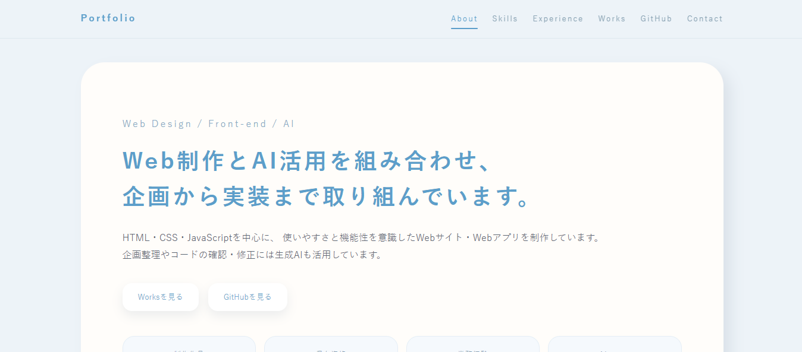

# Portfolio



**「学習の積み重ねと、AI活用による制作実績を一つに。」**

Web制作・AI活用・実務経験・資格・制作物をまとめたポートフォリオサイトです。

職業訓練校で学んだWeb制作の成果を中心に、制作物だけでなく、使用技術・資格・AI活用・実務経験まで一つのサイトで確認できるよう構成しました。

---

## 制作目的

* Web制作の学習成果をまとめる
* 制作物を分かりやすく紹介するポートフォリオサイトの制作
* HTML・CSS・JavaScriptによるサイト構築
* GitHub Pagesでの公開

---

## ターゲット

* 採用担当者
* Web制作・Webデザイン職の採用担当者
* 制作実績やスキルを確認したい方

---

## サイトコンセプト

「制作物だけではなく、人となりや学習姿勢も伝わるポートフォリオ」

作品・資格・AI活用・実務経験を一つのサイトにまとめ、これまでの学習内容や制作経験を分かりやすく紹介できる構成を目指しました。

---

## 使用技術

* HTML5
* CSS3
* JavaScript
* GitHub Pages

---

## 主な掲載内容

* About
* Skills
* AI Tools
* Qualifications
* Experience
* Works
* Contact

---

## 工夫したポイント

* 制作物だけでなく、資格・実務経験・AI活用も掲載し、人物像が伝わる構成にした
* シンプルで見やすいレイアウトを意識し、情報を整理
* 各制作物へスムーズにアクセスできる導線を設計
* GitHub・メールへのリンクを設置し、連絡しやすい構成にした
* レスポンシブ対応を行い、スマートフォンからも閲覧しやすいデザインを採用

---

## ディレクトリ構成

```text
portfolio/
├── css/
├── img/
├── js/
├── index.html
└── README.md
```

---

## 公開ページ

https://pluto007-lab.github.io/portfolio/

---

## GitHub

https://github.com/pluto007-lab

---

## 制作

職業訓練校での学習成果をまとめるために制作しました。

制作物・資格・AI活用・実務経験を一つのサイトに集約し、継続的に更新・改善を行っています。
