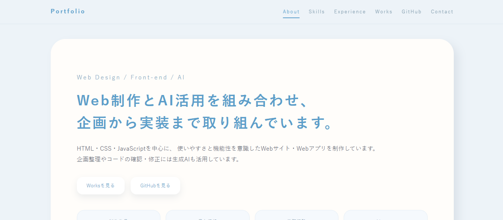

# Portfolio



**「Web制作とAI活用、その両方を実践するポートフォリオ。」**

Web制作・AI活用・実務経験・資格・制作物をまとめたポートフォリオサイトです。

職業訓練校で学んだWeb制作の成果を中心に、制作物だけでなく、使用技術・資格・実務経験・生成AIの活用方法まで、一つのサイトで確認できる構成にしています。

---

## 公開ページ

https://pluto007-lab.github.io/portfolio/
https://portfolio.pluto-lab.com

---

## 制作目的

- Web制作の学習成果をまとめる
- 制作物やスキルを分かりやすく紹介するポートフォリオサイトの制作
- HTML・CSS・JavaScriptを用いたWebサイト構築
- 採用担当者が短時間で人物像やスキルを把握できる情報設計
- GitHub Pagesによる公開

---

## ターゲット

- Web制作・Web開発職の採用担当者
- ポートフォリオを閲覧する企業担当者
- 制作実績やスキルを確認したい方

---

## サイトコンセプト

**「制作物だけではなく、学習姿勢や改善力も伝えるポートフォリオ」**

作品・資格・実務経験・AI活用を一つのサイトにまとめ、これまでの学習内容や制作経験を分かりやすく紹介できる構成を目指しました。

また、制作物を継続的に改善し、その過程も伝えられるポートフォリオを意識しています。

---

## 使用技術

- HTML5
- CSS3
- JavaScript
- Git
- GitHub
- GitHub Pages

---

## AI活用

制作では複数の生成AIを用途に応じて使い分けています。

- ChatGPT：企画整理・要件定義・文章作成・レビュー
- Codex：既存コードの確認・修正・機能追加
- Claude：実装相談・コードレビュー
- Gemini：アイデア整理・調査
- NotebookLM：資料整理・情報収集
- Manus：試作・検証

AIの出力をそのまま採用するのではなく、内容を確認・検証しながら改善を繰り返すことを意識しています。

---

## 主な掲載内容

- About
- Skills
- AI Tools
- Qualifications
- Experience
- Works
- Contact

---

## 工夫したポイント

### 情報を整理した構成

採用担当者が短時間で必要な情報へアクセスできるよう、About・Skills・Worksなどをセクションごとに整理しました。

### 制作物以外も伝える

制作物だけでなく、資格・実務経験・AI活用も掲載し、学習内容や人物像が伝わる構成にしています。

### AI活用を具体的に紹介

使用しているAIツールだけでなく、それぞれの役割や活用方法も紹介しています。

### 更新しやすい設計

新しい制作物や資格を追加しやすい構成とし、継続的にポートフォリオを改善できるよう設計しました。

### レスポンシブ対応

PC・タブレット・スマートフォンの各画面サイズで閲覧しやすいレイアウトを実装しています。

---

## ディレクトリ構成

```text
portfolio/
├── css/
├── img/
├── js/
├── index.html
└── README.md
```

---

## 学んだこと

- 情報設計を意識したポートフォリオ制作
- HTML・CSS・JavaScriptによるサイト構築
- レスポンシブデザインの実装
- 制作物を継続的に改善する重要性
- AIを活用した制作フローの構築
- GitHub Pagesによる公開

---

## 今後改善したい点

- 制作物ごとの詳細ページ追加
- ダークモード対応
- アニメーションの改善
- Lighthouseによるパフォーマンス改善
- アクセシビリティのさらなる向上
- 新しい制作実績の追加

---

## 制作について

職業訓練校での学習成果をまとめるために制作しました。

現在も新しい制作物や学習内容に合わせて継続的に更新しており、制作実績だけでなく、学習の過程や改善の積み重ねも伝えられるポートフォリオを目指しています。
